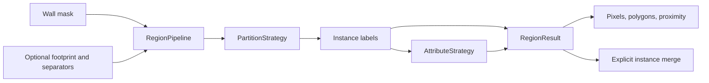

# Design and contracts

`RegionPipeline` is an application service. `PartitionStrategy` and `AttributeStrategy` are protocols; connected components, distance watershed, unknown attributes, aligned class maps, and CPU ONNX attributes are replaceable implementations. Domain objects describe instances, polygon holes, attributes, and proximity without application services or network configuration.

The CLI is the composition entry point. Configuration is immutable, models are supplied explicitly, and ONNX sessions persist across calls. Installing PlanRegions does not install WallGraph. The packages cooperate through positive wall polarity and the versioned `wallgraph/1` coordinate contract rather than internal imports or shared model instances.

## Partitioning and exterior

The pipeline constructs barriers, constrains free space using an explicit footprint or excludes border-connected exterior, partitions instances, removes small regions, assigns attributes, builds polygons, and computes proximity. Inputs are not modified. Exterior exclusion occurs before partitioning so watershed cannot turn exterior-connected space into apparently interior islands.

Separators are explicit barriers. Closing and watershed require an explicit choice; neither establishes door semantics. Watershed selects one valid pixel per distance-maximum plateau, then deterministically suppresses nearby distinct maxima. Every free connected component receives a marker. This avoids duplicate seeds on a flat rectangular-room ridge but does not prevent noise or furniture from creating multiple peaks. Frozen predicted-wall experiments favored connected components.

Strategy IDs are compacted without allocating arrays according to the largest ID. Results use int32 instance labels. Semantic adapters cannot change those labels, allowing independent verification of geometry and attributes.

## Geometry and operations

`RegionResult.labels` is authoritative. Area and centroid come from instance pixels. Contour hierarchy preserves holes; contour simplification can change polygon area relative to the pixel count. A centroid can lie outside a concave or holed region, so a distance-based interior pixel is stored separately. Bounding-box computations restore coordinates to the original image.

Explicit merge operations preserve wall and excluded pixels, support disconnected MultiPolygons, recompute geometry/proximity, and record the ID mapping and operation duration. Conflicting attributes become unknown. For matching labels, coverage is weighted by instance pixel area. Original extraction timings are retained separately from later operation timings.

A proximity graph expands instance distances up to a configured Euclidean radius and finds meeting labels. It is not an accessibility graph; that requires opening evidence or a door detector.

## Evaluation

One pixel contingency pass builds the prediction/truth IoU matrix, including intersections with background when computing instance area. Sparse or unsigned instance IDs do not control matrix dimensions. SciPy's modified Jonker–Volgenant solver first maximizes the number of threshold-valid matches, then the total IoU across all assigned pairs, including subthreshold pairs. Only threshold-valid pairs enter F1/PQ. The reward and paper references are documented in [methods](methods.md).

The default rule is class-agnostic `IoU >= 0.5`, which differs at the boundary from strict `IoU > 0.5` protocols. Reports expose instance F1 and PQ. Pixel coverage does not stand in for correct room counts, and semantic accuracy is not reported without semantic truth.
