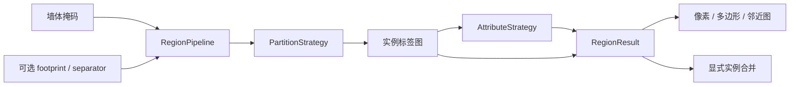

# 设计说明

`RegionPipeline` 是应用服务；`PartitionStrategy` 和 `AttributeStrategy` 是策略协议；`ConnectedPartition`、`WatershedPartition`、`ClassMapAttributes` 与 `OnnxAttributes` 是可替换实现。领域对象只描述实例、多边形、属性和邻近关系，不包含网络地址、OCR 请求、存储身份或设备推荐规则。

CLI 是组合入口，通过参数注入依赖。单独安装 PlanRegions 不需要 WallGraph；两者通过墙体极性与 `wallgraph/1` 元数据协作。两套包共享坐标约定，不共享模型实例或内部模块。

流程依次为屏障构建、建筑范围约束或外部连通域排除、实例划分、小区域过滤、语义聚合、几何构建与邻近图。外部空间在划分之前排除，防止分水岭把连接外部的空间切成看起来不触边的室内区域。输入不修改。分隔线是有来源的显式屏障，闭运算与分水岭需主动开启。语义模型不会修改区域几何，以便分别验证区域识别和属性识别。

分水岭对距离图的同一极大值平台只放置一个种子，平台的代表点必须是该平台的实际像素；随后按距离值和坐标确定性地抑制相邻种子，并保证每个自由空间连通域至少有一个种子。这修复长方形房间被平坦脊线重复播种的问题，仍不能保证在噪声墙体或家具形成的距离峰上不发生过分割。真实评测中，默认连通域优于此可选策略。

`RegionResult.labels` 是几何真值来源。区域面积和质心直接由标签像素计算；多边形生成保留轮廓内环。像素质心不保证处在内部，距离变换产生独立 `interior_point`。手动合并重新计算这些字段和邻近图，保留所有被排除像素；多区域语义冲突时不继承任意标签。

同标签合并的属性覆盖率按像素面积加权，而不是取最小值或简单平均。提取阶段的计时保留在 `timings_ms`，后续人工合并独立记录到 `operations`，包含每次映射与耗时，避免将原始推理时间误认为合并时间。

邻近图用欧氏距离扩展实例并寻找标签相遇边界，半径为配置参数。它表达几何接近，不能替代通行关系图；后者需要门洞证据或独立门检测器。

评估使用独立人工实例图，以一次像素交叉计数构造预测/标注 IoU 矩阵，背景交叉也计入实例面积；实例编号不决定数组大小。SciPy 的改进 Jonker–Volgenant 求解器优先最大化满足阈值的匹配数，再最大化所有指派对的总 IoU，其中包含未达阈值的配对；F1/PQ 只计入达标配对。目标函数与论文出处见[方法说明](methods.zh-CN.md)。默认条件为 `IoU >= 0.5`，与采用严格 `IoU > 0.5` 的协议有边界差异。不用像素覆盖率冒充房间数量正确率。不提供语义准确率，因为当前 manifest 没有语义标注。

`compare_regions` 是独立的变化比较服务：用两份对齐整数标签图建立实际正重叠的稀疏表，并保留各实例的背景流量。二部图将一对多、多对一、多对多关系组织为对应组；背景不会连接无关实例，单纯换编号也不改变几何结论。它不修改输入、不需要真值，负责定位观测变化；独立真值上的准确率评测仍是另一项操作。报告契约与自动复核入口见[变化诊断](comparison.zh-CN.md)。
